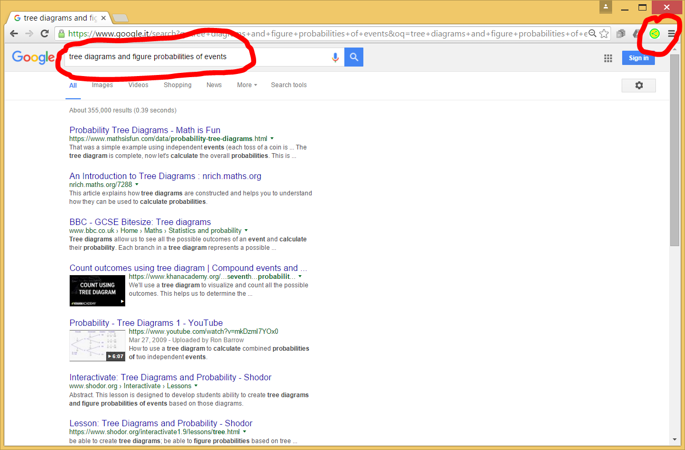
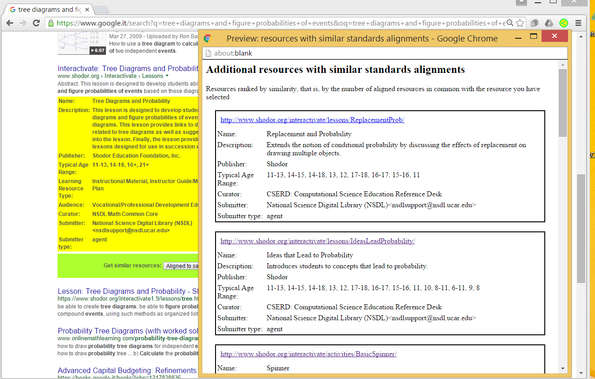

# **ERD**: Educational Resources Discoverer

***Note:*** 
Following an evaluation with actual teachers, this prototype has been redesigned.
Please check the ***superseding prototype*** [RepExp (Replicator-Expander)](https://github.com/renatomario/RepExp).
_ _ _ _ _ _ _ _ _ _

ERD (Educational Resources Discoverer) is a Chrome™ browser extension that injects custom-rich-snippets in Google™ results pages, containing  “***transparent***” expansion functionalities to (or suggestions for) “***similar***” resources (in addition to LRMI metadata).
 
It is “***transparent***”, in the sense that it makes use of (sometimes large numbers of) standards alignments without the need for users to be aware of them. Among other advantages, this makes it possible to reuse the considerable efforts in aligning resources to educational standards, as crowdsourced high-quality curated data, in Countries where formal educational standards are not used.

“***Similar***” resources are identified and ranked according to a similarity metrics, defined as the number of shared alignments to educational standards. 

The objective of this first prototype / proof of concept, is to share one of the ideas being developed in the context of an analysis of strategies employed by educators to discover educational resources: any feedback welcome!

## Sample screenshots

As a meaningful test pattern, search in Google for: \<**tree diagrams and figure probabilities of events**\>. Here is the resulting Google page:

Following a mouse-click on the ERD extension button (top right), custom rich snippets (two in this particular case) are injected in the previous results-page. They contain expansion buttons with “volume indicators”, plus the available (LRMI) metadata (two screenshots):

.")

.")

Clicking on one of the available expansion buttons, a new window is displayed, containing related resources ranked by similarity, with relevant (LRMI) metadata. Of course it also contains links to directly navigate to the educational resources of interest:

>### **Test patterns**
>
>You may try the application with the following test patterns. The first one of them is fully documented in the above screenshots section.
>
>Format:
>*Google search string / number of expanded metadata / number of expansion links (volume indicator)*
>* tree diagrams and figure probabilities of events / 2 / 2 (1381, 55)
>* advanced fire simulator / 1 / 1 (52)
>* equivalent fractions finder / 1 / 1 (1494)
>* Modeling Linear Relationships / 1 / 1 (109)
>* Solving Linear Inequalities inequality notation and a graphic representation / 1 / 1 (49)

### **Warning**

This prototype works fine (use the test patterns above) when the Learning Registry servers are not too overloaded, for example during night hours in the USA.

### **Acknowledgments**

This implementation relies on the powerful Extract Data Services of the Learning Registry (many thanks to Steve Midgley, Joe Hobson, Jim Klo and Douglas McAuliffe). Metadata about learning resources, again obtained from the Learning Registry, are injected in the snippets by extension content scripts, along the lines of the “Browser Plugin” (Pat Lockley) and “AMPS” (Jim Klo) demonstrations available in the Learning Registry Community Projects.
